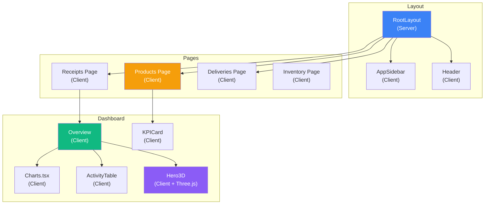

# Component Architecture Guide — CoreInventory

Complete guide to React components, state management, and UI patterns used in CoreInventory.

---

## 📋 Table of Contents

1. [Component Overview](#component-overview)
2. [Layout Components](#layout-components)
3. [Dashboard Components](#dashboard-components)
4. [Page Components](#page-components)
5. [UI Components (shadcn)](#ui-components-shadcn)
6. [State Management](#state-management)
7. [Hooks](#hooks)
8. [Patterns & Best Practices](#patterns--best-practices)

---

## Component Overview



---

## Layout Components

### RootLayout (`src/app/layout.tsx`)

**Type:** Server Component (RSC)

**Purpose:** Root layout wrapper for the entire application.

**Responsibilities:**
- Initialize authentication context
- Set up global providers (themes, toasts)
- Define meta tags and charset
- Include global CSS

**Props:** None (automatic)

**Children:** Page routes

**Example:**

```tsx
export default function RootLayout({
  children,
}: {
  children: React.ReactNode;
}) {
  return (
    <html lang="en">
      <body>
        <ThemeProvider>
          <ConditionalLayout>
            {children}
          </ConditionalLayout>
        </ThemeProvider>
      </body>
    </html>
  );
}
```

---

### DashboardLayout (`src/app/(dashboard)/layout.tsx`)

**Type:** Server Component

**Purpose:** Layout for protected dashboard routes.

**Structure:**

```tsx
<div className="flex">
  <AppSidebar />
  <div className="flex-1">
    <Header />
    <main className="p-6">
      {children}
    </main>
  </div>
</div>
```

**Children:** All dashboard pages (`/inventory`, `/products`, etc.)

---

### AppSidebar (`src/components/layout/AppSidebar.tsx`)

**Type:** Client Component (`'use client'`)

**Purpose:** Left-side navigation sidebar.

**Features:**
- Dynamic route highlighting (via `usePathname`)
- Role-based menu items
- Collapsible sections
- User profile dropdown in footer
- Logout functionality

**Props:** None

**State:**
- Current pathname (for active highlighting)
- Menu collapse state (mobile)

**Menu Items (Role-Based):**

| Route              | Title         | Icon      | Min. Role       |
| ------------------ | ------------- | --------- | --------------- |
| `/inventory`       | Dashboard     | Dashboard | WAREHOUSE_STAFF |
| `/products`        | Products      | Box       | WAREHOUSE_STAFF |
| `/receipts`        | Receipts      | Download  | MANAGER         |
| `/deliveries`      | Deliveries    | Upload    | MANAGER         |
| `/inventory`       | Inventory     | Package   | WAREHOUSE_STAFF |
| `/stock-ledger`    | Stock Ledger  | History   | MANAGER         |
| `/transfers`       | Transfers     | Move      | MANAGER         |
| `/adjustments`     | Adjustments   | Settings  | MANAGER         |
| `/warehouses`      | Warehouses    | Building  | MANAGER         |
| `/users`           | Users         | Users     | SUPER_ADMIN     |
| `/profile`         | Profile       | User      | ALL             |
| `/settings`        | Settings      | Gear      | SUPER_ADMIN     |

**Example:**

```tsx
"use client";

export function AppSidebar() {
  const pathname = usePathname();
  const router = useRouter();
  
  const isActive = (route: string) => pathname.startsWith(route);
  
  return (
    <Sidebar>
      <SidebarContent>
        <SidebarGroup>
          <SidebarGroupLabel>Navigation</SidebarGroupLabel>
          <SidebarMenu>
            {navItems.map((item) => (
              <SidebarMenuItem key={item.url}>
                <SidebarMenuButton
                  isActive={isActive(item.url)}
                  asChild
                >
                  <Link href={item.url}>
                    <item.icon />
                    <span>{item.title}</span>
                  </Link>
                </SidebarMenuButton>
              </SidebarMenuItem>
            ))}
          </SidebarMenu>
        </SidebarGroup>
      </SidebarContent>
      
      <SidebarFooter>
        {/* User dropdown */}
      </SidebarFooter>
    </Sidebar>
  );
}
```

---

### Header (`src/components/layout/Header.tsx`)

**Type:** Client Component

**Purpose:** Top navigation bar with page title and utilities.

**Features:**
- Page title and breadcrumb
- Search input
- Low stock notifications badge
- User profile menu
- Theme toggle

**Props:**
- `title: string` — Current page title
- `description?: string` — Subtitle

**Example:**

```tsx
"use client";

export function Header({ title, description }: HeaderProps) {
  return (
    <header className="border-b bg-white p-6">
      <div className="flex items-center justify-between">
        <div>
          <h1 className="text-2xl font-bold">{title}</h1>
          {description && (
            <p className="text-sm text-gray-600">{description}</p>
          )}
        </div>
        <div className="flex items-center gap-4">
          <SearchInput />
          <NotificationBell />
          <ProfileDropdown />
        </div>
      </div>
    </header>
  );
}
```

---

## Dashboard Components

### Overview (`src/components/dashboard/Overview.tsx`)

**Type:** Client Component

**Purpose:** Main dashboard home page showing KPIs and recent activity.

**Features:**
- Real-time metrics fetching
- KPI cards with animations (GSAP)
- Recent transactions chart
- Activity table
- Filter by transaction type
- Hero 3D visualization (lazy loaded)

**Data Fetched:**
- Products (with stock status)
- Transactions (recent 10)
- Dashboard statistics

**State:**
- `products` — List of items with stock status
- `transactions` — Recent movements
- `filter` — Current filter (ALL, RECEIPT, DELIVERY, etc.)
- `loading` — Fetch loading state

**Example:**

```tsx
"use client";

export function DashboardOverview() {
  const [products, setProducts] = useState<ProductSummary[]>([]);
  const [transactions, setTransactions] = useState<TransactionSummary[]>([]);
  const [filter, setFilter] = useState<DashboardFilter>("ALL");

  useEffect(() => {
    const loadSummary = async () => {
      const [productsRes, transactionsRes] = await Promise.all([
        fetch('/api/products'),
        fetch('/api/transactions')
      ]);
      
      const products = await productsRes.json();
      const transactions = await transactionsRes.json();
      
      setProducts(products.data);
      setTransactions(transactions.data);
    };
    
    loadSummary();
  }, []);

  return (
    <div className="space-y-6">
      <div className="grid grid-cols-4 gap-4">
        <KPICard icon={Package} label="Total Products" value={products.length} />
        <KPICard icon={AlertTriangle} label="Low Stock" value={lowStockCount} />
        <KPICard icon={TrendingUp} label="Total Value" value={`$${totalValue}`} />
        <KPICard icon={Activity} label="This Month" value={monthlyCount} />
      </div>
      
      <div className="grid grid-cols-2 gap-6">
        <MovementChart data={transactions} />
        <CategoryChart data={products} />
      </div>
      
      <ActivityTable data={transactions} />
    </div>
  );
}
```

---

### KPICard (`src/components/dashboard/KPICard.tsx`)

**Type:** Client Component

**Purpose:** Display a single KPI metric.

**Features:**
- Icon display
- Value with trend indicator
- Optional link to detail page
- Smooth animations

**Props:**

```typescript
interface KPICardProps {
  icon: React.ComponentType<any>;
  label: string;
  value: string | number;
  trend?: number;          // % change
  trendLabel?: string;     // e.g., "+5.2%"
  href?: string;           // Link on click
}
```

**Example:**

```tsx
<KPICard
  icon={Package}
  label="Total Products"
  value={45}
  trend={12}
  trendLabel="+12% from last month"
  href="/products"
/>
```

**Rendered CSS Classes:**

```html
<div class="rounded-lg border bg-white p-6 hover:shadow-lg cursor-pointer">
  <div class="flex items-center justify-between">
    <div>
      <p class="text-sm text-gray-600">Total Products</p>
      <p class="text-3xl font-bold">45</p>
      <p class="text-xs text-green-600">+12% from last month</p>
    </div>
    <Package class="h-12 w-12 text-blue-500" />
  </div>
</div>
```

---

### Charts (`src/components/dashboard/Charts.tsx`)

**Type:** Client Component

**Purpose:** Display analytics charts for movements and categories.

**Charts:**

1. **MovementChart** — Bar chart of IN/OUT/TRANSFER/ADJUSTMENT counts
2. **CategoryChart** — Pie chart of items by category

**Dependencies:** Recharts library

**Props:**

```typescript
interface ChartsProps {
  data: Transaction[];
}
```

**Example:**

```tsx
<ResponsiveContainer width="100%" height={300}>
  <BarChart data={groupedByType}>
    <CartesianGrid strokeDasharray="3 3" />
    <XAxis dataKey="type" />
    <YAxis />
    <Tooltip />
    <Legend />
    <Bar dataKey="count" fill="#3b82f6" />
  </BarChart>
</ResponsiveContainer>
```

---

### ActivityTable (`src/components/dashboard/ActivityTable.tsx`)

**Type:** Client Component

**Purpose:** Display recent transactions in table format.

**Features:**
- Striped rows with hover effect
- Transaction type color coding
- Timestamp display
- Item name and quantity
- Location information

**Props:**

```typescript
interface ActivityTableProps {
  data: TransactionSummary[];
  limit?: number;
}
```

---

### Hero3D (`src/components/dashboard/Hero3D.tsx`)

**Type:** Client Component with Three.js

**Purpose:** 3D data visualization of warehouse inventory.

**Technologies:**
- Three.js (3D library)
- React Three Fiber (React binding for Three.js)
- @react-three/drei (utility helpers)

**Features:**
- Animated 3D warehouse model
- Interactive camera controls
- Falling box particles (stock representation)
- GSAP animations

**Example:**

```tsx
import { Canvas } from '@react-three/fiber';

export function Hero3D() {
  return (
    <Canvas auto camera={{ position: [0, 0, 15] }}>
      <ambientLight intensity={0.5} />
      <pointLight position={[10, 10, 10]} />
      <WarehouseModel />
      <StockParticles />
    </Canvas>
  );
}
```

---

## Page Components

### Products Page (`src/app/(dashboard)/products/page.tsx`)

**Type:** Client Component

**Purpose:** Product inventory listing and management.

**Features:**
- Table of all products
- Search by name/SKU
- Filter by category and stock status
- Create product modal
- Edit product modal
- Delete product confirmation
- Sort by column

**State:**
- `products` — List of products
- `search` — Search term
- `category` — Category filter
- `status` — Stock status filter
- `isCreateOpen` — Create modal visibility
- `editingProduct` — Product being edited
- `loading` — Fetch state

**Data Operations:**
- Fetch: `GET /api/products`
- Create: `POST /api/products`
- Update: `PUT /api/products/:id`
- Delete: `DELETE /api/products/:id`

**Table Columns:**

| Column     | Type    | Sortable | Details              |
| ---------- | ------- | -------- | -------------------- |
| SKU        | String  | ✓        | Product identifier   |
| Name       | String  | ✓        | Product name         |
| Category   | String  | ✓        | Item category        |
| Stock      | Number  | ✓        | Current quantity     |
| Status     | Badge   | —        | IN_STOCK / LOW / OUT |
| Actions    | Buttons | —        | Edit, Delete, View   |

---

### Receipts Page (`src/app/(dashboard)/receipts/page.tsx`)

**Type:** Client Component

**Purpose:** Manage inbound shipments.

**Features:**
- Table of all receipts
- Filter by status
- Search by reference/supplier
- Create receipt modal
- View receipt details
- Validate receipt (creates IN transactions)
- Cancel receipt
- Delete receipt

**Receipt Status Badge Colors:**

```javascript
const statusColors = {
  DRAFT: { bg: '#f3f4f6', text: '#374151' },
  WAITING: { bg: '#fef3c7', text: '#92400e' },
  READY: { bg: '#dbeafe', text: '#1e40af' },
  DONE: { bg: '#d1fae5', text: '#065f46' },
  CANCELED: { bg: '#fee2e2', text: '#7f1d1d' }
};
```

**Workflow:**

```
1. Manager creates Receipt (DRAFT)
   ↓ Adds line items
2. Updates to WAITING (goods expected)
   ↓ Physically arrives
3. Changes to READY (ready to validate)
   ↓ Manager validates
4. Changes to DONE
   → Stock updated (+quantity for each item)
   → IN transactions created
```

---

### Deliveries Page (`src/app/(dashboard)/deliveries/page.tsx`)

**Type:** Client Component

**Purpose:** Manage outbound shipments.

**Features:**
- Table of all deliveries
- Filter by status and warehouse
- Search by reference/destination
- Create delivery modal
- View delivery details
- Validate delivery (creates OUT transactions)
- Cancel delivery
- Delete delivery

**Error Validation:**

```javascript
// Before validating delivery
if (currentStock < requestedQty) {
  showError(`Insufficient stock: have ${currentStock}, need ${requestedQty}`);
  return;
}
```

**Workflow:**

```
1. Manager creates Delivery (DRAFT)
   ↓ Adds line items (checked against stock)
2. Updates to WAITING
   ↓ Customer confirmed
3. Changes to READY (ready to ship)
   ↓ Manager validates
4. Changes to DONE
   → Stock decreased (-quantity for each item)
   → OUT transactions created
```

---

### Inventory Page (`src/app/(dashboard)/inventory/page.tsx`)

**Type:** Client Component

**Purpose:** Real-time stock levels by warehouse and location.

**Features:**
- Warehouse selector
- Table of stock by location
- Search by item name
- Show: Item, SKU, Location, Quantity, Unit
- View item details

**Stock Status Calculation:**

```javascript
function getStockStatus(qty, minStock) {
  if (qty <= 0) return 'OUT_OF_STOCK';
  if (qty <= minStock) return 'LOW_STOCK';
  return 'IN_STOCK';
}
```

---

### Stock Ledger Page (`src/app/(dashboard)/stock-ledger/page.tsx`)

**Type:** Client Component

**Purpose:** Complete audit trail of all transactions.

**Features:**
- Filter by transaction type (IN/OUT/TRANSFER/ADJUSTMENT)
- Search by item name/SKU
- Date range filtering
- Show: Reference, Type, Item, Qty, From, To, User, Date, Notes
- Export to CSV (future)

**Transaction Type Colors:**

```javascript
const typeColors = {
  IN: '#10b981',
  OUT: '#ef4444',
  TRANSFER: '#f59e0b',
  ADJUSTMENT: '#8b5cf6'
};
```

---

## UI Components (shadcn/ui)

CoreInventory uses shadcn/ui components. Key ones:

| Component      | File                    | Purpose                    |
| -------------- | ----------------------- | -------------------------- |
| Button         | `ui/button.tsx`         | All buttons                |
| Input          | `ui/input.tsx`          | Text inputs, search        |
| Select         | `ui/select.tsx`         | Dropdowns, filters         |
| Dialog         | `ui/dialog.tsx`         | Modals                     |
| Table          | `ui/table.tsx`          | Data tables                |
| Badge          | `ui/badge.tsx`          | Status badges, labels      |
| Toast          | `ui/sonner.tsx`         | Notifications              |
| Card           | `ui/card.tsx`           | Container component        |
| Skeleton       | `ui/skeleton.tsx`       | Loading placeholder        |
| Alert          | `ui/alert.tsx`          | Alert messages             |
| Form           | `ui/form.tsx`           | Form wrapper               |
| Sheet          | `ui/sheet.tsx`          | Sidebar drawer             |
| Spinner        | `ui/spinner.tsx`        | Loading spinner            |

**Installation:**

```bash
# Example: Add a new component
npx shadcn-ui@latest add modal
```

---

## State Management

### Authentication State (JWT Token)

**Storage Location:** HttpOnly Cookie (`auth_token`)

**Access:**
```typescript
// In middleware
const token = request.cookies.get("auth_token")?.value;

// In server actions
const cookieStore = await cookies();
const token = cookieStore.get("auth_token")?.value;
```

**Token Payload:**

```typescript
interface JWTPayload {
  userId: string;
  email: string;
  role: "SUPER_ADMIN" | "MANAGER" | "WAREHOUSE_STAFF";
  iat: number;
  exp: number;
}
```

### Context for Current User

**File:** Implemented inline in pages/components

**Pattern:**

```tsx
"use client";

export function MyComponent() {
  const [user, setUser] = useState(null);

  useEffect(() => {
    async function fetchUser() {
      const res = await fetch('/api/me');
      const data = await res.json();
      setUser(data.user);
    }
    fetchUser();
  }, []);

  if (!user) return <Skeleton />;
  return <div>Welcome, {user.name}</div>;
}
```

### Form State (react-hook-form + Zod)

**Example:**

```tsx
import { useForm } from "react-hook-form";
import { zodResolver } from "@hookform/resolvers/zod";
import { z } from "zod";

const productSchema = z.object({
  sku: z.string().min(1, "SKU required"),
  name: z.string().min(1, "Name required"),
  categoryId: z.string().optional(),
});

export function ProductForm() {
  const form = useForm({
    resolver: zodResolver(productSchema),
  });

  const onSubmit = async (data) => {
    const res = await fetch("/api/products", {
      method: "POST",
      body: JSON.stringify(data),
    });
    form.reset();
  };

  return (
    <form onSubmit={form.handleSubmit(onSubmit)}>
      <Input {...form.register("sku")} />
      {form.formState.errors.sku && <span>{form.formState.errors.sku.message}</span>}
      <button type="submit">Create</button>
    </form>
  );
}
```

---

## Hooks

### `useToast()` (Custom)

**Purpose:** Trigger toast notifications.

**Usage:**

```tsx
const { toast } = useToast();

toast({
  title: "Success",
  description: "Product created successfully",
  variant: "default" // or "destructive"
});
```

### `usePathname()` (Next.js)

**Purpose:** Get current route.

**Usage:**

```tsx
const pathname = usePathname();
if (pathname.startsWith("/admin")) {
  // Show admin features
}
```

### `useRouter()` (Next.js)

**Purpose:** Programmatic navigation.

**Usage:**

```tsx
const router = useRouter();
router.push("/products");
router.refresh(); // Revalidate data
```

### `useGSAPStagger()` (Custom)

**Purpose:** GSAP stagger animations for lists.

**Usage:**

```tsx
const ref = useGSAPStagger();

return (
  <div ref={ref}>
    {items.map(item => (
      <div key={item.id} className="item">
        {item.name}
      </div>
    ))}
  </div>
);
```

### `useMobile()` (Custom)

**Purpose:** Detect if viewport is mobile.

**Usage:**

```tsx
const isMobile = useMobile();

if (isMobile) {
  return <MobileLayout />;
} else {
  return <DesktopLayout />;
}
```

---

## Patterns & Best Practices

### Server vs Client Components

**Server Components (Default):**
- Pages (`page.tsx`)
- Layouts
- Data fetching
- Sensitive operations

```tsx
// src/app/(dashboard)/page.tsx (Server)
export default async function DashboardPage() {
  const stats = await getDashboardStats();
  return <DashboardOverview stats={stats} />;
}
```

**Client Components:**
- Interactive elements
- useState, useEffect
- Event handlers
- Browser APIs

```tsx
// src/components/dashboard/Overview.tsx (Client)
"use client";

export function DashboardOverview(props) {
  const [filter, setFilter] = useState("ALL");
  // Interactive logic
}
```

### Data Fetching Patterns

**Server-Side (Recommended):**

```tsx
// Server Component
async function ProductsPage() {
  const products = await fetch('/api/products');
  return <ProductsList initialData={products} />;
}
```

**Client-Side (For Interactive):**

```tsx
"use client";

// Client Component
function ProductsList({ initialData }) {
  const [products, setProducts] = useState(initialData);
  
  useEffect(() => {
    // Refetch on filter change
  }, [filter]);
}
```

### Form Submission

**Pattern:**

```tsx
async function handleSubmit(e: React.FormEvent) {
  e.preventDefault();
  
  try {
    const response = await fetch('/api/products', {
      method: 'POST',
      headers: { 'Content-Type': 'application/json' },
      body: JSON.stringify(formData)
    });
    
    if (!response.ok) throw new Error(await response.text());
    
    const result = await response.json();
    toast({ title: "Success", description: result.data.message });
    setFormData({}); // Reset
    router.refresh(); // Revalidate
  } catch (error) {
    toast({ title: "Error", description: error.message, variant: "destructive" });
  }
}
```

### Table Component Pattern

```tsx
import {
  Table, TableBody, TableCell, TableHead, TableHeader, TableRow,
} from "@/components/ui/table";

export function ProductsTable({ data }) {
  return (
    <Table>
      <TableHeader>
        <TableRow>
          <TableHead>SKU</TableHead>
          <TableHead>Name</TableHead>
          <TableHead>Stock</TableHead>
          <TableHead>Actions</TableHead>
        </TableRow>
      </TableHeader>
      <TableBody>
        {data.map(product => (
          <TableRow key={product.id}>
            <TableCell>{product.sku}</TableCell>
            <TableCell>{product.name}</TableCell>
            <TableCell>{product.totalStock}</TableCell>
            <TableCell>
              <Button onClick={() => handleEdit(product.id)}>Edit</Button>
              <Button onClick={() => handleDelete(product.id)}>Delete</Button>
            </TableCell>
          </TableRow>
        ))}
      </TableBody>
    </Table>
  );
}
```

### Modal Form Pattern

```tsx
"use client";

export function CreateProductModal({ isOpen, onClose }) {
  const [formData, setFormData] = useState({});
  const [loading, setLoading] = useState(false);

  const handleSubmit = async (e) => {
    e.preventDefault();
    setLoading(true);
    
    try {
      const response = await fetch("/api/products", {
        method: "POST",
        body: JSON.stringify(formData)
      });
      
      if (response.ok) {
        toast({ title: "Success", description: "Product created" });
        onClose();
      }
    } finally {
      setLoading(false);
    }
  };

  return (
    <Dialog open={isOpen} onOpenChange={onClose}>
      <DialogContent>
        <DialogHeader>
          <DialogTitle>Create Product</DialogTitle>
        </DialogHeader>
        
        <form onSubmit={handleSubmit}>
          <Input
            placeholder="SKU"
            onChange={(e) => setFormData({ ...formData, sku: e.target.value })}
          />
          
          <Button type="submit" disabled={loading}>
            {loading ? "Creating..." : "Create"}
          </Button>
        </form>
      </DialogContent>
    </Dialog>
  );
}
```

---

## Performance Optimization

### Code Splitting

```tsx
// Lazy load Hero3D component
const Hero3D = lazy(() => import("@/components/dashboard/Hero3D"));

export function Dashboard() {
  return (
    <Suspense fallback={<Skeleton height={400} />}>
      <Hero3D />
    </Suspense>
  );
}
```

### Image Optimization

```tsx
import Image from "next/image";

export function ProductImage({ src, alt }) {
  return (
    <Image
      src={src}
      alt={alt}
      width={200}
      height={200}
      priority={false}
      loader={({ src, width }) => `${src}?w=${width}`}
    />
  );
}
```

### Memoization

```tsx
import { memo } from "react";

// Prevent re-renders if props unchanged
const ProductCard = memo(function ProductCard({ product }: { product: Product }) {
  return <div>{product.name}</div>;
});
```

---

## Testing Components

### Unit Test Example

```typescript
import { render, screen } from "@testing-library/react";
import { KPICard } from "@/components/dashboard/KPICard";
import { Package } from "lucide-react";

it("displays KPI card with correct values", () => {
  render(
    <KPICard
      icon={Package}
      label="Total Products"
      value={45}
    />
  );
  
  expect(screen.getByText("Total Products")).toBeInTheDocument();
  expect(screen.getByText("45")).toBeInTheDocument();
});
```

---

**Last Updated:** March 15, 2026
